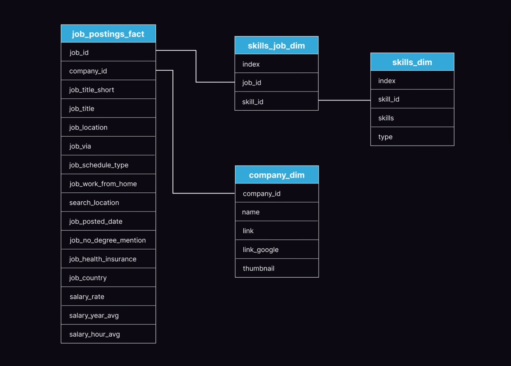
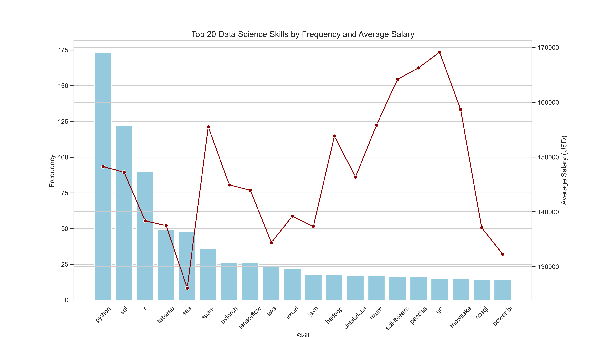
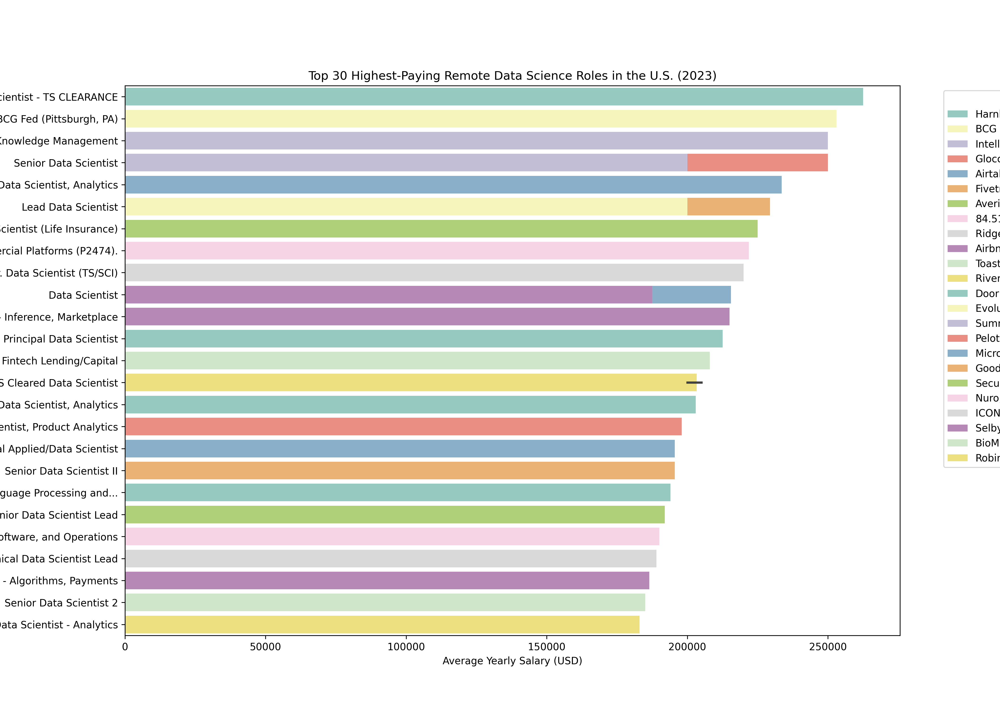

# 📊 SQL Project: Data Scientist Job Market Analysis

This project analyzes a dataset of data science job postings using SQL to uncover trends in salaries, in-demand skills, and career-advancing technologies. The goal is to deliver actionable insights for job seekers, educators, and recruiters.

---

## 🧭 Introduction

In a competitive and fast-evolving job market, knowing which **skills**, **tools**, and **titles** lead to better opportunities is essential. This project leverages structured job posting data to identify key trends using SQL. The analysis focuses on answering the most relevant career questions for data science professionals.

## 🗂️ Folder Structure

```

SQL\_PROJECT\_DATA\_JOB\_ANALYSIS/
├── .vscode/                         # VSCode workspace settings (excluded in .gitignore)
├── csv\_files/                      # Raw and processed CSV datasets (excluded in .gitignore)
├── figure/                         # Generated figures and charts
├── sql\_load/                       # Scripts for creating and loading the database schema
│   ├── 1\_create\_database.sql
│   ├── 2\_create\_tables.sql
│   ├── 3\_modify\_tables.sql
│   └── 4\_monthly\_job\_posting\_tables.sql  # Creates monthly job posting tables for granular analysis
├── sql\_queries/                    # SQL queries addressing analysis questions
│   ├── 1\_top\_paying\_jobs.sql
│   ├── 2\_top\_paying\_skills.sql
│   ├── 3\_top\_skills.sql
│   ├── 4\_top\_skills\_salary.sql
│   ├── 5\_optimal\_skills.sql
│   ├── 6\_company\_salaries.sql
│   ├── 7\_job\_title\_types.sql
│   ├── 8\_degree\_required.sql
│   ├── 9\_job\_location.sql
│   ├── 10\_health\_insurance.sql
│   └── 11\_skills\_combination.sql
├── .gitignore
├── SQL\_Database\_Diagram.png        # Entity Relationship Diagram (ERD) of the schema
├── report.md                       # Full analysis report
└── README.md                       # Project documentation

```

## 🔗 Dataset

- Dataset ZIP file (CSV format): [Google Drive link](https://drive.google.com/file/d/1KZmnzNo3EKnbpSuQCTVMPT6F3osVue5h/viewk)

---

## 🗺️ ER Diagram



This diagram shows the schema for the relational database built to conduct this analysis, including relationships between jobs, skills, companies, and additional attributes.

---

## 🔒 .gitignore

```

.vscode/
csv\_files/

```

These directories are ignored to avoid uploading large datasets and editor configurations.

## ❓ Key Questions

This project answers the following data-driven questions using SQL:

1. **What are the top-paying data scientist jobs?**
2. **What skills are required for these high-paying roles?**
3. **What are the most in-demand skills across the job market?**
4. **Which skills are associated with higher average salaries?**
5. **Which skills are both in high demand and high paying (optimal to learn)?**
6. **(Bonus)** Additional insights:
   - Company-wise salary trends
   - Common job title patterns
   - Degree requirements
   - Remote vs. onsite job locations
   - Health insurance availability
   - Skills combinations in single job roles

---

## 🛠️ Tools Used

- **SQL** – Core querying language used for data analysis.
- **PostgreSQL** – RDBMS for schema creation, data manipulation, and analysis.
- **Python** – For further EDA, visualization, or automation.
- **Visual Studio Code** – Code editor with SQL and Git integration.
- **Git & GitHub** – Version control and collaboration.

---

## 🧠 Analysis Overview

### 1. **Top-Paying Data Scientist Jobs**
Filtered roles by salary and location to isolate the highest-paid opportunities.



_Insight: Remote roles dominate the highest-paying bracket, with specialized titles (e.g., “Principal Data Scientist,” “Machine Learning Lead”) consistently topping the list._

---

### 2. **Skills for Top-Paying Roles**
Joined job postings with skill listings to identify high-value skills associated with top-paying roles.



_Insight: Tools like **Django**, **Apache Beam**, and **Snowflake** were recurrent in roles above $160,000/year._

---

### 3. **Most In-Demand Skills**

| Skill      | Demand Count |
|------------|--------------|
| Python     | 10,390       |
| SQL        | 7,488        |
| R          | 4,674        |
| AWS        | 2,593        |
| Tableau    | 2,458        |

_Insight: Python and SQL are universally required, followed by cloud platforms and BI tools._

---

### 4. **Skills by Salary**

| Skill         | Avg. Salary (USD) |
|---------------|-------------------|
| GDPR          | 217,738           |
| Golang        | 208,750           |
| Selenium      | 180,000           |
| Neo4j         | 171,655           |
| Redis         | 162,500           |

_Insight: Emerging or specialized technologies like **Golang**, **GDPR**, **Neo4j** offer lucrative returns despite lower demand._

---

### 5. **Optimal Skills to Learn (High Demand + High Salary)**

| Skill        | Demand | Avg. Salary |
|--------------|--------|-------------|
| AWS          | 217    | 149,630     |
| TensorFlow   | 126    | 151,536     |
| PyTorch      | 115    | 152,603     |
| Snowflake    | 72     | 152,687     |
| Scala        | 56     | 156,702     |

_Insight: Invest in cloud platforms, deep learning libraries, and modern data stack tools to remain competitive._

---

### 6–11. **Additional Analytical Queries**

- **Company-Level Salary Insights** – Which companies offer the highest compensation?
- **Job Title Variations** – Patterns among job title naming conventions.
- **Degree Requirements** – Whether a master’s or PhD is commonly requested.
- **Job Locations** – Top cities and states for DS roles.
- **Health Insurance** – Which postings explicitly mention benefits.
- **Skills Co-occurrence** – Most frequent skill pairings across job ads.

---

## 🧩 Future Work

- Extend **monthly_job_posting_tables.sql** to allow time-series trend analysis by month.
- Integrate **Python notebooks** for modeling and visualization.
- Automate data ingestion pipelines from live job boards.
- Perform NLP on job descriptions to extract latent topics or job archetypes.